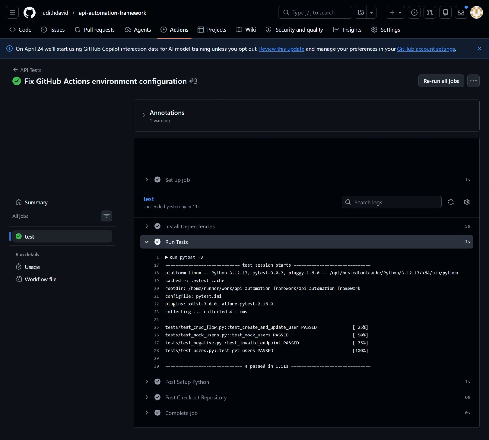
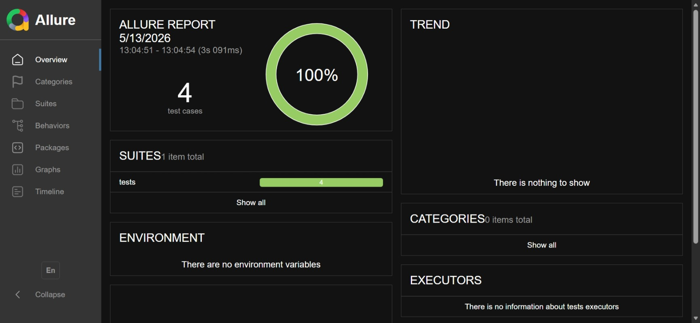
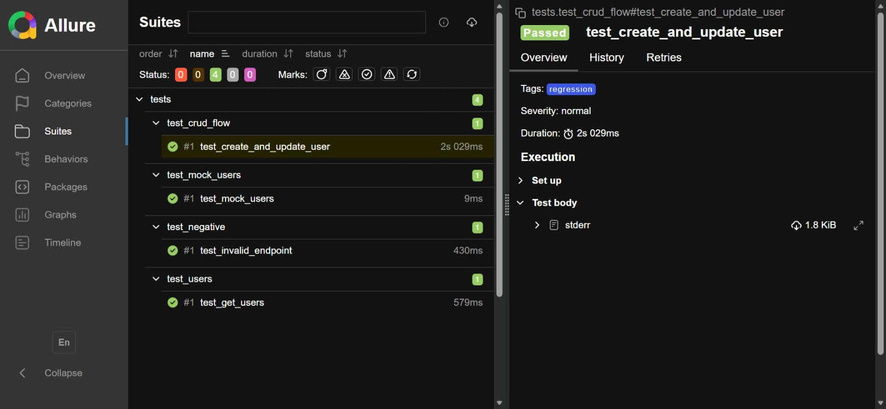

# API Automation Framework

Production-grade API automation framework built using Python, PyTest, and Requests with reusable client architecture, centralized validation, structured logging, schema validation, mocking support, environment-based configuration, and CI-ready design.

---

# Current Status

- 4 automated API tests
- GitHub Actions CI passing
- Allure reporting integrated
- Mocking support enabled
- Schema validation implemented

---

# Features

- Reusable HTTP client using `requests.Session`
- Retry strategy for transient failures
- Structured logging with request tracing
- Environment-based configuration using `.env`
- Response abstraction layer
- Schema validation using `jsonschema`
- Custom assertion layer
- CRUD API workflow validation
- Positive and negative API testing
- Mocking support using `responses`
- Smoke and regression test tagging
- CI-ready architecture
- Allure reporting support

---

# Tech Stack

- Python 3.12
- PyTest
- Requests
- JsonSchema
- Responses
- Allure PyTest
- Python Dotenv
- GitHub Actions

---

# Framework Architecture

```text
api-automation-framework/
│
├── clients/
│   └── api_client.py
│
├── config/
│   └── config.py
│
├── core/
│   ├── assertions.py
│   └── response.py
│
├── schemas/
│   └── user_schema.py
│
├── tests/
│   ├── test_users.py
│   ├── test_crud_flow.py
│   ├── test_negative.py
│   └── test_mock_users.py
│
├── utils/
│   ├── loggers.py
│   └── validators.py
│
├── images/
│
├── logs/
│
├── reports/
│
├── .github/
│
├── conftest.py
├── pytest.ini
├── requirements.txt
├── .env.example
├── .gitignore
└── README.md
```

---

# API Under Test

Public REST API provided by ReqRes:

https://reqres.in

---

# Logging System

The framework supports configurable logging levels through `.env`.

## DEBUG Mode

Logs:
- Request URL
- Payload
- Response body
- Response timing
- Request tracing IDs

## INFO Mode

Logs:
- Request URL
- Response status
- Response timing

Error responses are always logged.

---

# Test Coverage

The framework currently validates:

- GET users
- CRUD workflow
- Negative endpoint validation
- Schema validation
- Mocked API responses
- Response contract validation

---

# Environment Configuration

Create a `.env` file in the project root.

Example:

```env
API_BASE_URL=https://reqres.in/api
API_TIMEOUT=10

API_EMAIL=your_email
API_PASSWORD=your_password

API_KEY=your_api_key

LOG_LEVEL=DEBUG
```

---

# Installation

## 1. Clone Repository

```bash
git clone https://github.com/judithdavid/api-automation-framework.git
cd api-automation-framework
```

---

## 2. Create Virtual Environment

### Windows

```bash
python -m venv venv
venv\Scripts\activate
```

### Mac/Linux

```bash
python3 -m venv venv
source venv/bin/activate
```

---

## 3. Install Dependencies

```bash
pip install -r requirements.txt
```

---

# Running Tests

## Run Full Suite

```bash
pytest -v
```

---

## Run Smoke Tests

```bash
pytest -m smoke
```

---

## Run Regression Tests

```bash
pytest -m regression
```

---

## Run Mock Tests

```bash
pytest tests/test_mock_users.py -v
```

---

# Allure Reporting

Generate reports:

```bash
pytest --alluredir=reports
```

Open report:

```bash
allure serve reports
```

---

# CI Pipeline

GitHub Actions automatically executes the API test suite on every push and pull request.

## GitHub Actions Workflow



---

# Reporting Dashboard

## Allure Dashboard



---

## Allure Test Execution



---

# Key Engineering Highlights

- Modular and scalable architecture
- Centralized API handling
- Reduced flaky test behavior through mocking
- Production-style logging strategy
- Environment-driven configuration
- Clean separation of concerns
- Reusable validation and assertion layers
- CI-verified execution on GitHub Actions

---

# Future Improvements

- Pydantic response models
- Parallel execution using pytest-xdist
- Dockerized execution
- Performance testing integration
- Contract testing support

---